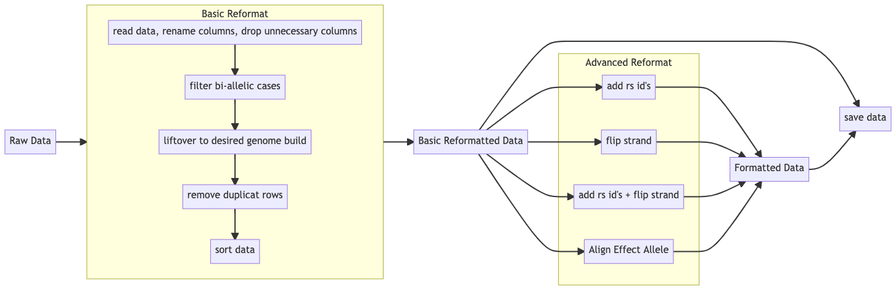

# DataIntegrator
Data Integration tools for genetic data in Python


# Primary Functions
1. Basic Reformat
    - Read raw genome data, unify input type, rename columns to standardized format, and drop unnecessary columns
    - Liftover to desired genome build (i.e. from hg38 -> hg19)
    Given a input genome build version and a output genome build version, liftover the genome build of the input chr:pos pair to the desired version.
    - Deduplication of key consisted of (Chr + BP)
    Drop all rows containing duplicate keys
    - Sort the data according to chromosome and base pair position
2. Advanced Reformat
    - Add RsID
    Add rsID according to chr and pos position in the data file.

   - Flip Strand to Forward
    Step 1: Query dbSnp153 databse to get the two alleles of the forward strand according to chr and pos.
    Step 2: Compare the two alleles with the input GWAS summary file, if all ATCG appears, flip the GWAS summary file using the A-T and C-G rule.

   - Align Effect allele: available in the next release
    Input two gwas summary files, then use the first one as reference and make sure the second file has the same effect allele. If the effect allele is changed, the effect size will also be changed accordingly.



# Getting Started
### Dependencies
1. Install dependencies:
   Before installing the `DataIntegrator` package, the following packages are required to be installed in advance in your environment:
    - pyliftover
    `pip install pyliftover`
    - numpy
    `pip install numpy`
    - pandas
    `pip install pandas`
    - pyBigWig
    `pip install pyBigWig`
    - Install the package
    `pip install dataintegrator`
2. Dowload `dbSnp153.bb` (`hg19` version recommended)
   Data processing including adding missing data and querying database as reference requires fetching data from the UCSC website. You can accomplish this by using the `query_data()` function. The query data function will query the data from a built in link that points to the dbSnp153 hosted on UCSC genome browser, but we recommend downloading the `dbSnp153.bb` file from the UCSC website [(download here)](http://hgdownload.soe.ucsc.edu/gbdb/hg38/snp/dbSnp153.bb) to local directory. By doing this, the runtime of `query_data()` will be significantly reduced.

### Using the pacakge
There are two ways to use the packages:
1. Using the ready-to-use the command line wrappers (cli) with the parameter template (`*.JSON`) in the examples folder
    - Choose the command line wrapper you want to use.
    - Fill in the corresponding JSON parameters template, for example (Detailed documentation of each cli wrapper will be listed below):
    ```JSON
    {
        "input_path" : "$your_path_to_input_raw_file",
        "output_path" : "$your_path_to_output_directory",
        "output_name" : "$name_of_your_output_file",
        "dbSnp153_path": "$path_to_your_local_dbSnp153.bb",
        "select_cols": "$your_choice_of_options_to_select_cols",
        "filter_rows": "$your_choice_of_options_to_filter_rows"
    }
    ```
    - In your unix/linux command line, start running the program, for example:
    ```
       python basic_reformat_cli.py basic_reformat.JSON
    ```
    - 
2. Build your own working pipeline with the function provided by the package in python
    -   ```python 
        from dataintegrator import DataIntegrator as di
        ```
    - Setting inital parameters: 
        * input_path (the path of the data to be processed)
        * output_path (the path you want the processed result to be saved to)
        * input_format (e.g. "hg19")
        * output_format (e.g. "hg38")

    - Start using the provided functions, e.g.: 
        ```python 
        input_path = "<path_to_your_data_file>.gz"
        df = di.read_data(input_path, '\t', "#chrom","pos", "rsids" ,"alt", "ref", "maf",    "beta", "sebeta", "pval")
        #print(df)
        ```
3. To view example calls of the main functions, clone this repository and see the `.py` files under the `/tutorial` directory.


# Output Code Reference Table
These codes serve as reference for the codes shown in the comment column of the output file
| Code | Name             | Explanation                                                                                     |
|------|------------------|-------------------------------------------------------------------------------------------------|
|A     |Added             | Sign indicating rs id has been added                                                            |
|S     |Same              | Sign indicating the rs id/ strand is the same as dbSnp153                                       |
|D     |Different         | Sign indicating the rs id/ strand is different from dbSnp153                                    |
|F     |Flipped           | Sign indicating the strand has been filpped                                                     |
|ID    |Insertion/Deletion| Sign indicating dbSnp153 record contains Insertion/Deletion for the current Chr + BP combination|
|NF    |Key Not Found     | Sign indicating record in dbSnp153 cannot befound for the current Chr + BP combination          |


# Command Line (cli) Wrappers Documentation
1. **basic_reformat_cli.py**
   This cli should be used with the `basic_reformat.JSON` parameter template. Fill the template with the desired choice of parameters.
   - Usage
    ```
    python basic_reformat_cli.py [*path_to_basic_reformat.JSON*]
    ```
   - Require parameters
    ```JSON
    {
        "input_path" : "data/finngen_R4_AB1_ARTHROPOD.gz",
        "output_path" : "result",
        "input_format" : "hg38",
        "output_format" : "hg19",
        "output_name" : "basic_reformat",
        "Chr_col_name" : "#chrom",
        "BP_col_name" : "pos",
        "SNP_col_name" : "rsids",
        "A1_col_name" : "alt",
        "A2_col_name" : "ref", 
        "EAF_col_name" : "maf",
        "Beta_col_name" : "beta",
        "Se_col_name" : "sebeta",
        "P_col_name" : "pval"
    }
    ```
2. **advanced_reformat_cli.py** (Will be released in the next version)
   This cli should be used with the `advanced_reformat_cli.JSON` parameter template. Fill the template with the desired choice of parameters.
   - Usage: the advanced reformat wrapper should be use on the data that has performed basic reformat
    ```
    python basic_reformat_cli.py [*path_to_advanced_reformat.JSON*]
    ```
   - Require parameters
    ```JSON
    {
        "input_path" : "result/basic_reformat.gz",
        "output_path" : "result",
        "output_name" : "added_rsids",
        "dbSnp153_path": "data/dbSnp153.bb",
        "select_cols": "drop_comments",
        "filter_rows": "drop"
    }
    ```
3. **flip_strand_cli.py**
   This cli should be used with the `flip_strand_cli.JSON` parameter template. Fill the template with the desired choice of parameters.
   - Usage: the flip strand wrapper should be use on the data that has performed basic reformat
    ```
    python basic_reformat_cli.py [*path_to_flip_strand.JSON*]
    ```
   - Require parameters
    ```JSON
    {
        "input_path" : "result/basic_reformat.gz",
        "output_path" : "result",
        "output_name" : "added_rsids",
        "dbSnp153_path": "data/dbSnp153.bb",
        "select_cols": "drop_comments",
        "filter_rows": "drop"
    }
    ```
    - Notes:
      - the `select_cols` parameter instruct the program about how the columns of the data should be kept and outputed. Valid choices contain: `"inplace"`, `"drop_comments"`, and `"all"`. 
        - `"inplace"`: this will tell the program to write the flipped of `A1` and `A2` to the original columns. The original format will be preserved
        - `"all"`: this will display the columns in the original data and adding the `new_A1` and `new_A2` columns that contain the alleles after flipping strand. Also a `comment` column will be added to indicating the status of flipping strand. Code/Flag can be consulted in the reference table provided above
        - `"drop_comments"`: this will result in the same output as the `"all"` choice except the comment column is dropped
      - the `filter_rows` parameter instruct the program about how the rows of the data should be kept and outputed. Valid choices contain: `"drop"`, `"all"`, and `"errors"`.
        - `"drop"`: drop all rows (cases) where the results cannot be found from the dbSnp153 or the record in dbSnp153 shows that insertion/deletion exists
        - `"all"`: keep all rows
        - `"errors"`: only out put the rows that have not been correctly flipped (contain indel or key cannot be found) and have potential problem where the strand in the provided data is different from the strand of dbSnp153
4. **add_rsid_cli.py**
   This cli should be used with the `add_rsid_cli.JSON` parameter template. Fill the template with the desired choice of parameters.
   - Usage: the add rsid wrapper should be use on the data that has performed basic reformat
    ```
    python basic_reformat_cli.py [*path_to_add_rsid.JSON*]
    ```
   - Require parameters
    ```JSON
    {
        "input_path" : "result/basic_reformat.gz",
        "output_path" : "result",
        "output_name" : "added_rsids",
        "dbSnp153_path": "data/dbSnp153.bb",
        "select_cols": "drop_comments",
        "filter_rows": "drop"
    }
    ```
    - Notes:
      - the `select_cols` parameter instruct the program about how the columns of the data should be kept and outputed. Valid choices contain: `"inplace"`, `"drop_comments"`, and `"all"`. 
        - `"inplace"`: this will tell the program to add rsid in the original SNP column. The original format will be preserved
        - `"all"`: this will display the columns in the original data and adding a new `added_rsid` column that contain the result of adding missing columns. Also a `comment` column will be added to indicating the status of adding rsid. Code/Flag can be consulted in the reference table provided above
        - `"drop_comments"`: this will result in the same output as the `"all"` choice except the comment column is dropped
      - the `filter_rows` parameter instruct the program about how the rows of the data should be kept and outputed. Valid choices contain: `"drop"`, `"all"`, and `"errors"`.
        - `"drop"`: drop all rows (cases) where the rows of the `added_rsid` column is `NA`.
        - `"all"`: keep all rows
        - `"errors"`: only show rows (cases) where the rows of the `added_rsid` column is `NA`.

# Functions Documentation


## 1. Function to read data in formatted ways

### Read Data
```python
read_data( input_path, Chr_col_name, BP_col_name, SNP_col_name, A1_col_name, A2_col_name, EAF_col_name, Beta_col_name, Se_col_name, P_col_name, separate_by="\t")
```
Description: This function reads the data to be processed and output it in a formatted way
    
Parameters
- input_path (str): the complete or relative path of the input data
- Chr_col_name (str): the column name in the original data representing chromosome
- BP_col_name (str): the column name in the original data representing base pair position
- SNP_col_name (str): the column name in the original data representing rsID
- A1_col_name (str): the column name in the original data representing effect allele
- A2_col_name (str): the column name in the original data representing non-effect allele
- EAF_col_name (str): the column name in the original data represneting allele frequency for effect allele
- Beta_col_name (str): the column name in the original data represneting effect size for effect allele
- Se_col_name (str): the column name in the original data represneting standard error for effect size
- P_col_name (str): the column name in the original data represneting p-value
- separate_by (str): the delimiter of the original data, '\t' by default (tab separated)

Returns:
- pandas.DataFrame: return formatted data in the form of pandas DataFrame in the following ways:

| Chr    | BP     | SNP    | A1     | A2     | EAF    | Beta   | Se     | P      |
| ------ | ------ | ------ | ------ | ------ | ------ | ------ | ------ | ------ |
| 1      | 438956 | rs4596 | G      | A      | 0.0021 | -0.538 | 0.5802 | 0.3533 |
| X      | 704956 | rs1234 | T      | C      | 0.0242 | 0.1685 | 0.2469 | 0.0843 |

Example Usage:
```python
input_path = "<path_to_your_data_file>.gz"
df = di.read_data(input_path, '\t', "#chrom","pos", "rsids" ,"alt", "ref", "maf",    "beta", "sebeta", "pval")
#print(df)
```


## 2. Functions to clean data for further processing

### Filter bi-allelic
```python
filter_bi_allelic(df, rest=False)
```
Function to filter only bi-allelic cases in the data

Parameters:
- df (pandas.DataFrame): The data frame to be filtered.
- rest (boolean): value indicating wether or not to keep (mark only) the non-bi-allelic cases. Default to False.

Returns:
- pandas.DataFrame: return filtered data in the form of pandas DataFrame.

Example:
```python 
bi_allelic = di.filter_bi_allelic(df)

# if you want to check the non-bi-allelic cases, use the following command
bi_allelic = di.filter_bi_allelic(df, rest=True)
```

### Deduplicate
```python
deduplicate(df)
```
Function to drop rows in data containing dduplicate keys (Chr + BP)

Parameters:
- df (pandas.DataFrame): The data frame to be deduplicated.

Returns:
- pandas.DataFrame: return filtered data in the form of pandas DataFrame.

Example:
```python
deduplicated = di.deduplicate(df)
```

### Sort by Chr and BP
```python
sort_by_chr_bp(df)
```
Function to sort the data based on Chr and BP

Parameters:
- df (pandas.DataFrame): the data to be sorted

Returns:
- pandas.DataFrame: return the sorted data

Example:
```python
sorted_data = di.sort_by_chr_bp(df)
```


## 3. Functions to query data from dbSnp153 for further processing

### Query UCSC Database for dbSNP153 info
```python
query_data(df, link="http://hgdownload.soe.ucsc.edu/gbdb/hg38/snp/dbSnp153.bb")
```
Function to query required data from dbSnp153

Parameters:
- df (pandas.DataFrame): the data we want more info
- link (str): path or link of the '.bb' file of dbSnp153 

Returns:
- pandas.DataFrame: return complete information from dbSnp153 as a python dictionary

Example:
```python
link = "<path_to_your_dbSnp153_path>.bb"
dbSnp153 = di.query_data(df, link) # This will usually take longer time
```

### Save Object
```python
save_obj(obj, name )
```

Function to save python data structure on disk

Parameters:
- obj (obj): the data structure/object to be saved on disk.
- name (str): the name for the obj to be saved as.

Returns:
- return nothing

Example:
```python
di.save_obj(dbSnp153, "obj/dbSnp153")
```

### Load Object
```python
load_obj(obj_path )
```
Function to load saved python data structure from disk

Parameters:
- name (str): the name of the saved obj on disk to be loaded

Returns:
- pandas.DataFrame: return complete information from dbSnp153 as a python dictionary

Example:
```python
dbSnp153 = di.load_obj("obj/dbSnp153.pkl")
```


## 4. Functions to process data

### Lift Over
```python
lift_over(df, lo_dict, keep_all=False, inplace= False, comment=False)
```
Function to lift over genome build

Parameters:
- df (pandas.DataFrame): the data to be lifted over
- lo_dict (python dictionary): the lift over dictionary return from the create_lo function
- keep_unconvertible (boolean): if true, the function will keep and mark the rows that are not convertible. Default to False.
- keep_original_version (boolean): if true, the function will keep the Chr + BP of original genome build. Default to False.

Returns:
- pandas.DataFrame: return the data being lifted over to the desired genome build

Use two tables to illustrate output

Example:
```python
input_format = "hg<**>"
output_format = "hg<**>"
lo = create_lo(input_format, output_format) # create chain file as reference for genome-build-lift-over.

# drop unconvertible rows and keep only the result after lift over.
lift_over = di.lift_over(df, lo)
print(lift_over)

# keep and mark rows that are not convertible
lift_over = di.lift_over(df, lo, keep_unconvertible=True)

# keep the original genome build version as separate columns in the data set
lift_over = di.lift_over(df, lo, keep_orginal_version=True)
```

### Add Rsid's
add_rsid(df, data, keep_all=False, inplace=False, show_comment=False, show_errors=False)

Function to query and add rs ID for rows missing rsIDs.

Parameters:
- df (pandas.DataFrame): the data to be added rs_ids
- data (python dictionary): the dictionary containing required info from dbSnp153
- keep_all (boolean): value indicating whether the function should keep all rows in the original dataset. Default to False.
- inplace (boolean): value indicating whether the function should replace the original rsID column with the new added_rsid column. Default to True.
- show_comment (boolean): value indicating whether the function should add a column indicating the status of adding rsID. Default to False.
- show_errors (boolean): value indicating whether the function will output a table containing rows that cannot be properly added rsIDs. Default to False.

    1. "added" : missing rsID in orginal dataset. The Chr+BP key can be found in dbSNP153 and the rsID is successfully added
    2. "same": the original dataset have the same rsID as dbSnp153. No need to modify or add.
    3. "different": the original dataset have different rsID as compared to dbSnp153. Use dbSnp153 153 as reference to repalce the original.
    4. "key not found" : The Chr+BP key in original dataset cannot be found in dbSnp153. Fill in NA value. Mark in the comment column.

Returns:
- pandas.DataFrame: return the data being added rs_ids.


Example Call:
```python
added_rsid = di.add_rsid(df, dbSnp153)
```

A few example output:

`inplace = False, show_comment=False, keep_all=False`
| Chr    | BP     | SNP    | A1     | A2     | EAF    | Beta   | Se     | P      | added_rsid|
| ------ | ------ | ------ | ------ | ------ | ------ | ------ | ------ | ------ | --------- |
| 1      | 438956 | <NA>   | G      | A      | 0.0021 | -0.538 | 0.5802 | 0.3533 | rs12445   |
| X      | 704956 | rs1234 | T      | C      | 0.0242 | 0.1685 | 0.2469 | 0.0843 | rs1234    |

`inplace = True, show_comment=False, keep_all=False`
| Chr    | BP     | SNP    | A1     | A2     | EAF    | Beta   | Se     | P      |
| ------ | ------ | ------ | ------ | ------ | ------ | ------ | ------ | ------ |
| 1      | 438956 | rs12445| G      | A      | 0.0021 | -0.538 | 0.5802 | 0.3533 |
| X      | 704956 | rs1234 | T      | C      | 0.0242 | 0.1685 | 0.2469 | 0.0843 |


`inplace = False, show_comment=True, keep_all=False`
| Chr    | BP     | SNP    | A1     | A2     | EAF    | Beta   | Se     | P      | added_rsid| comment|
| ------ | ------ | ------ | ------ | ------ | ------ | ------ | ------ | ------ | --------- | ------ |
| 1      | 438956 | <NA>   | G      | A      | 0.0021 | -0.538 | 0.5802 | 0.3533 | rs12445   | "added"|
| X      | 704956 | rs1234 | T      | C      | 0.0242 | 0.1685 | 0.2469 | 0.0843 | rs1234    | "same" |

`check_errors=True`
| Chr    | BP     | SNP    | A1     | A2     | EAF    | Beta   | Se     | P      | added_rsid| comment|
| ------ | ------ | ------ | ------ | ------ | ------ | ------ | ------ | ------ | --------- | ------ |
| 1      | 438956 | <NA>   | G      | A      | 0.0021 | -0.538 | 0.5802 | 0.3533 | <NA>      | "key not found"|
| X      | 704956 | <NA>   | T      | C      | 0.0242 | 0.1685 | 0.2469 | 0.0843 | <NA>      | "key not found" |

### Flip Strand
```python
flip_strand( df, data, keep_all=False, inplace = False, show_comment=False, show_errors=False)
```
Function to flip the input data to forward strand

Parameters:
- df (pandas.DataFrame): the data to be flipped to forward strand
- data (python dictionary): the dictionary containing required info from dbSnp153
- keep_all (boolean): value indicating whether the function should keep all rows in the original dataset. Default to False.
- inplace (boolean): value indicating whether the function should replace the original A1 and A2 columns with the new_A1 and new_A2 columns. Default to False.
- show_comment (boolean): value indicating whether the function should add a column indicating the status of flipping strand. Default to False.
- show_errors (boolean): value indicating whether the function will output a table containing rows where strand cannot be properly flipped. Default to False.

    1. "flipped" : The Chr+BP key can be found in dbSNP153 and the strand is successfully flipped.
    2. "same": the original dataset uses the same strand as dbSnp153. No need to modify or add.
    3. "different": the original data set and its correspondence in dbSnp153 show completely different strand patter that cannot be flipped (e.g. T/C vs. C/A)
    4. "dbSnp153: Indel" : the A1 and A2 in dbSnp153 correponds to the Chr+BP in the processed data set contain Indel
    5. "key not found" : The Chr+BP key in original dataset cannot be found in dbSnp153. Fill in NA value. Mark in the comment column.

Returns:
- pandas.DataFrame: return the data being flipped to forward strand

Example:
```python
flipped = di.flip_strand(df, dbSnp153)
```

A few examples:

`inplace = False, show_comment=False, keep_all=False`
| Chr    | BP     | SNP    | A1     | A2     | EAF    | Beta   | Se     | P      | new_A1 | new_A2 |
| ------ | ------ | ------ | ------ | ------ | ------ | ------ | ------ | ------ | ------ | ------ |
| 1      | 438956 | <NA>   | G      | A      | 0.0021 | -0.538 | 0.5802 | 0.3533 | A      | G      |
| X      | 704956 | rs1234 | T      | C      | 0.0242 | 0.1685 | 0.2469 | 0.0843 | C      | T      |

`inplace = True, show_comment=False, keep_all=False`
| Chr    | BP     | SNP    | A1     | A2     | EAF    | Beta   | Se     | P      |
| ------ | ------ | ------ | ------ | ------ | ------ | ------ | ------ | ------ |
| 1      | 438956 | <NA>   | A      | G      | 0.0021 | -0.538 | 0.5802 | 0.3533 |
| X      | 704956 | rs1234 | C      | T      | 0.0242 | 0.1685 | 0.2469 | 0.0843 |


`inplace = False, show_comment=True, keep_all=False`
| Chr    | BP     | SNP    | A1     | A2     | EAF    | Beta   | Se     | P      | new_A1 | new_A2 | comment|
| ------ | ------ | ------ | ------ | ------ | ------ | ------ | ------ | ------ | ------ | ------ | ------ |
| 1      | 438956 | <NA>   | G      | A      | 0.0021 | -0.538 | 0.5802 | 0.3533 | G      | A      | "kept original"|
| 13     | 704956 | <NA>   | T      | C      | 0.0242 | 0.1235 | 0.2469 | 0.0673 | C      | T      | "flipped" |
| 22     | 568952 | <NA>   | A      | G      | 0.0267 | 0.7485 | 0.7869 | 0.0843 | <NA>   | <NA>   | "key not found" |
| X      | 274586 | <NA>   | C      | T      | 0.0243 | 0.1357 | 0.2435 | 0.1243 | G      | T      | "different" |


`check_errors=True`
| Chr    | BP     | SNP    | A1     | A2     | EAF    | Beta   | Se     | P      | new_A1 | new_A2 | comment|
| ------ | ------ | ------ | ------ | ------ | ------ | ------ | ------ | ------ | ------ | ------ | ------ |
| 22     | 568952 | <NA>   | A      | G      | 0.0267 | 0.7485 | 0.7869 | 0.0843 | <NA>   | <NA>   | "key not found" |
| X      | 274586 | <NA>   | C      | T      | 0.0243 | 0.1357 | 0.2435 | 0.1243 | G      | T      | "different" |

### Align Effect Allele and Effect Size between Two Datasets
```python
align_effect_allele( reference, df, show_errors=False)
```

This function will align the effect allele of input data based on a reference data

Parameters:
- reference (pandas.DataFrame): the reference table
- df (pandas.DataFrame): the data to be aligned
- check_error_rows (boolean): if true, the function will output the rows that cannot be aligned. Default to False.

Returns:
- pandas.DataFrame: return the data with its effect allele being aligned with the reference table.

Example:
```python
reference_path = "<path_to_your_reference_data_file>.gz"
reference_df = di.read_data(input_path, "chromosome","base_pair_location", "variant_id" ,"effect_allele", "other_allele", "effect_allele_frequency", "beta", "standard_error", "p_value") # for example
aligned = align_effect_allele(reference_df, df) # be sure df and reference_df are using the same genome build, and both data are properlly cleaned!!

# if you want to see rows that cannot be aligned
aligned = align_effect_allele(reference_df, df, check_error_rows=True)
```

## 5. Functions to save result

### Save Data
```python
save_data(output_path, df, name, save_format="gzip")
```

function to save the processed data in the tsv form as a gz file

Parameters:
- output_path (str): the path you want the data to be saved.
- df (pandas.DataFrame): the processed data to be saved.
- name (str): the output name of the data.
- save_format (str): the saving format. Choose between 'gzip' or 'csv'. Default to gz.

Returns:
pandas.DataFrame: return filtered data in the form of pandas DataFrame


Example:
```python
output_path = "<path_to_your_output_directory>" # "result" for example
di.save_data(output_path, aligned, "aligned")

# if you want to save the file as csv
di.save_data(output_path, aligned, "csv")
```


**Functions to be Implemented**
### Insert/ Filter/ Delete

### Create Tbi Index


